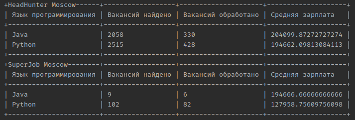

# Примерный уровнь зарплаты программиста с сайтов https://hh.ru/ и https://www.superjob.ru/

Программа загружает вакансии разработчиков с HeadHunter и SuperJob и 
считает среднюю зарплату для каждого языка программирования

### Как установить

Нужно заполнить файл окружения (файл .env) с переменной:
SJ_API_KEY- данный ключ получить можно на сайте https://api.superjob.ru/. 
При регистрации приложения от вас потребуют указать сайт. Введите любой, они не проверяют:)


Пример заполнения файла .env:

SJ_API_KEY=rghewhtbwerbnrtwbr

Python3 должен быть уже установлен. 
Затем используйте `pip` (или `pip3`, есть есть конфликт с Python2) для установки зависимостей:

```
pip install -r requirements.txt
```

Как пользоваться.

### vacancies.py

Для запуска программы необходимо выполнить команду:

```
python3 vacancies.py
```
Должна получится похожая таблица 

### Цель проекта

Код написан в образовательных целях на онлайн-курсе для веб-разработчиков [dvmn.org](https://dvmn.org/).
